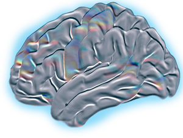
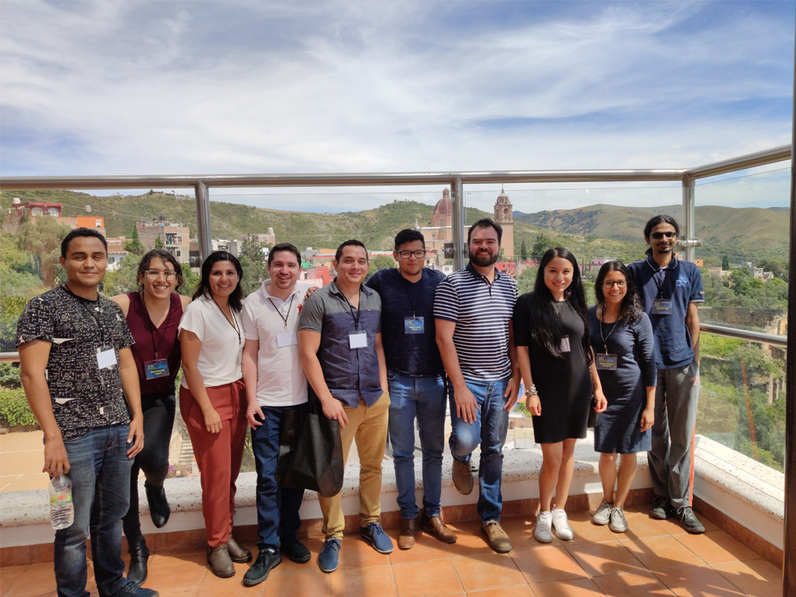

### [People](people.md) - [Publications](pub.md) - [Resources](res.md) - [Collaborators](col.md) - [Contact](contact.md) - [Github](https://github.com/garzalab)

## About

We are a research group, within the [National MRI Laboratory (LANIREM)](http://www.lanirem.inb.unam.mx/), at the [Institute of Neurobiology](http://inb.unam.mx/index.html), [National Autonomous University of Mexico (UNAM)](https://www.unam.mx/) in Querétaro, Mexico. 

Our mission is to conduct rigurous basic research focused on finding behavioral, neuroimaging, and other biological biomarkers in substance use disorders and other neuropsychiatric disorders, to use this knowledge to tackle applied and clinical questions, such as researching new treatments like neuromodulation.

**Lines of research**

* Frontostriatal system in substance use and addiction, and neuropsychiatric disorders.
* Identification of neuroimaging biomarkers in humans and animal models.
* Action mechanisms and possible uses of neuromodulation methods.

**Member of National & International Consortiums**

* [ENIGMA-Addiction World-wide Consortium](https://www.enigmaaddictionconsortium.com/).
* International Networks of tES /TMS Trials for Addiction Medicine (INTAM). [@INTAM_Network](https://twitter.com/INTAM_Network).
* [PRIMatE Data Exchange (PRIME-DE) Consortium](http://fcon_1000.projects.nitrc.org/indi/indiPRIME.html).
* Mexico Borderline Personality Disorder (BDP) Research Group.

