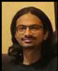
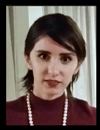
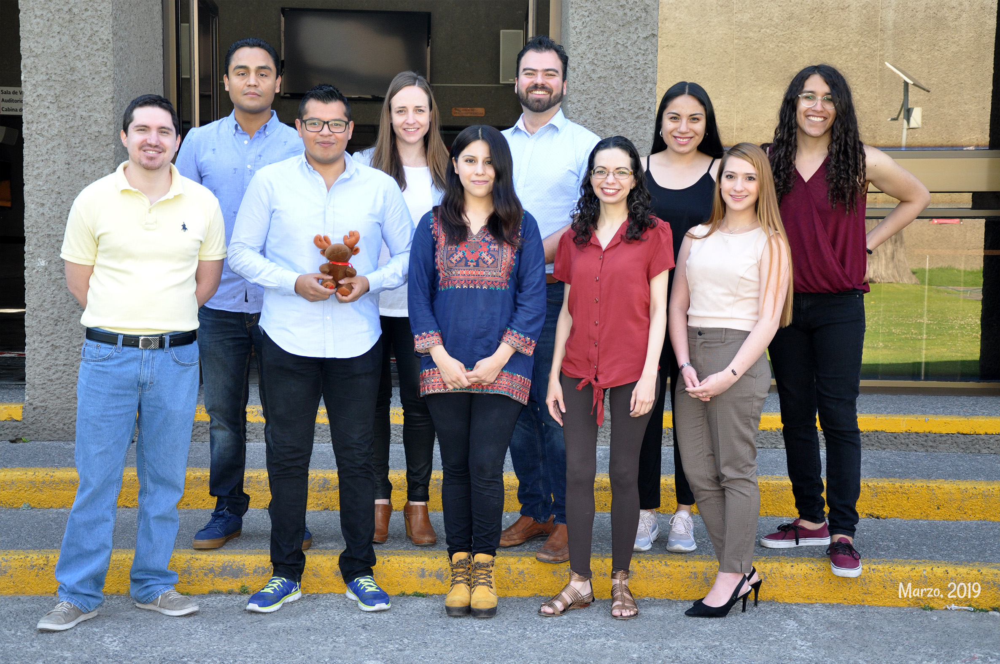
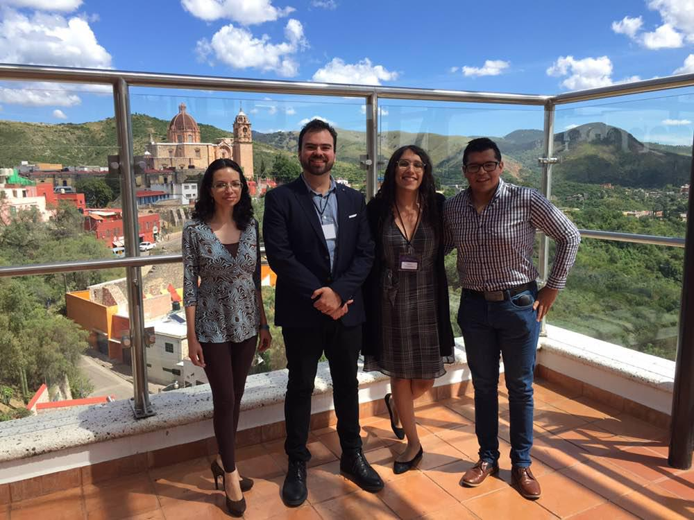
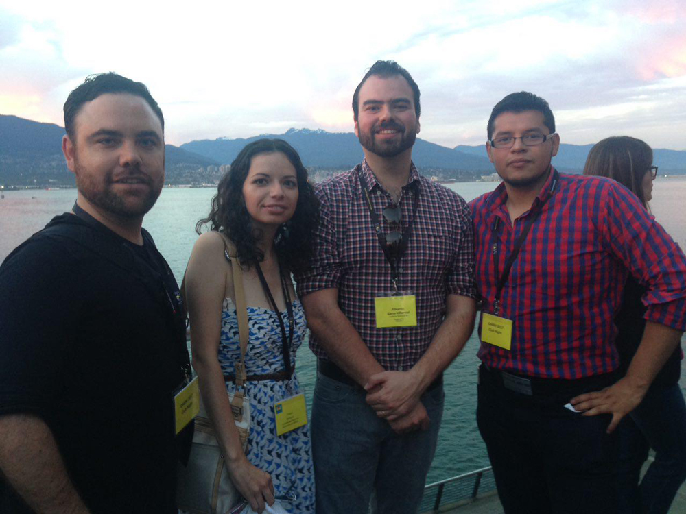

[<- Back](index.md)

## People

### Lab Leader (PI)

 Eduardo A. Garza-Villarreal, M.D., Ph.D.

* *Assistant Professor, Institute of Neurobiology, UNAM, Mexico.*

[Personal Website](https://egarza.github.io) - [Github](https://github.com/egarza) - [Twitter](https://twitter.com/egarzav) - [ResearchGate](https://www.researchgate.net/profile/Eduardo_Garza_Villarreal) - [Google Scholar](https://scholar.google.com/citations?user=bX502bUAAAAJ&hl=en) - [OSF](https://osf.io/uc6aj/) - [ORCID](https://orcid.org/0000-0003-1381-8648)

### PhD students

 Thania Balducci, M.D., M.Sc., Medical Sciences

### Master students

 Diego E. Ortuzar-Martínez, BSc, Neurobiology

 Alejandra Lopez-Castro, M.D., Neurobiology

 Diego Angeles-Valdez, B.A., Neurobiology

 Alan Davalos, M.D., Medical Sciences

### Research Assistants

 Jalil Rasgado, M.Sc.

 Juan Pablo Maya-Arteaga, M.D.

### External students (co-supervising)

 Luis A. Trujillo, M.Sc., Biochemistry

*Ph.D. Student, Faculty of Medicine, Universidad Autónoma de Nuevo León. Supervisor: [Alberto Camacho](https://scholar.google.com.mx/citations?user=4rbm3UYAAAAJ&hl=en)*

 Said Jimenez, M.Sc., Psychology

*Ph.D. Student, Faculty of Psychology, UNAM. Supervisor: [Juan José Sanchez Sosa](http://psicologia.posgrado.unam.mx/juan-jose-sanchez-sosa/)*

 Victor Pando, M.Sc.

*Ph.D. Student, Center for Music in the Brain, University of Aarhus, Denmark. Supervisor: [Peter Vuust](https://scholar.google.com/citations?user=DkKlEL0AAAAJ&hl=en&oi=ao)*

### Alumni

 Arun Garimella, Computer Sciences *(Currrently **RA** at Computational Neuroscience Labs, **ATR Institute International**, Kyoto, Japan*

 Alely Valencia, B.A. 

 Sofia Fernandez, M.Sc. *(Currently **PhD student** at Louis Collins Lab in **McGill University**)*

 Sigrid Lunde, Ph.D. *(Currently **PostDoc** at the Department of Psychology and Behavioral Sciences in **University of Aarhus**)*

 Viviana Villicaña, B.A. *(Currently* **MSc student** *at NeuroBIM-Bordeaux International Master of Neurosciences in* **University of Bordeaux***)*

 Josue Mendoza, B.A. *(Currently:* **Specialty** in Applied Statistics from the **IMAS UNAM***)*

 Pamela Palacios, M.Sc. *(Currently:* **Psychological Examiner** *at* **St. Jude Children's Research Hospital Memphis, Tennessee***)*

### Group Photos

*The team at the CIMAT Neuroimaging Meeting 2019 in Guanajuato, Mexico.*

*The team at the National Institute Psychiatry. From left to right, bottom: Alan, Diego, Alejandra, Thania, Viviana; top: Said, Ruth, Eduardo, Alely, Sofia.*

*At the CIMAT Neuroimaging Meeting 2018 in Guanajuato, Mexico.*

*At the OHBM Meeting 2016 in Vancouver, Canada.*